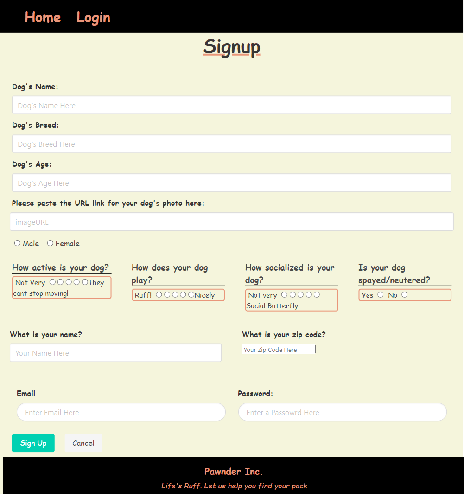
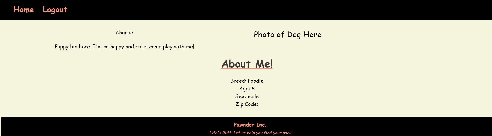

# Pawnder


## Description

We created a RESTful API that utilizes Handlebars as a template engine in conjunction with MySQL and Sequelize ORM to establish the datatbase. This project utilizes routes to reteieve and add new data. It also utilizes bcrypt

Through the use of node js and express to create a RESTful API using Handlebars as the template engine and MYSQL and sequelize ORM for the database. We demonstrated the use of routes to get and retrieve data. Also use them to display data on the page.

The site is deployed to heroku on with data and has a polished UI. The site is mobile friendly and uses bcrypt to encrypt the passwords.

## Table of Contents

- [Installation](#installation)
- [Usage](#usage)
- [Credits](#credits)
- [License](#license)

## Installation

Run

```text
git clone https://github.com/SnowSlurpie/woof-call
```

```text
npm run seed
```

```text
npm start
```

go to

```text
http://localhost:3001
```

for deployed link on heroku

```text
https://woof-call.herokuapp.com/
```

## Usage

This application will help you find other linke-minded owners with dogs that are looking for a playmate!

When you visit the website you will be asked to Log-in, or to create an account if you havent already.




## Credits

* Andrew Goetz - [GitHub](https://github.com/agoetz4407)
* Alex Running - [GitHub](https://github.com/SnowSlurpie)
* Joshua Rangai - [GitHub](https://github.com/jrrangai)
* Kristi Garcia-Stebbins - [GitHub](https://github.com/kristiboo03)
